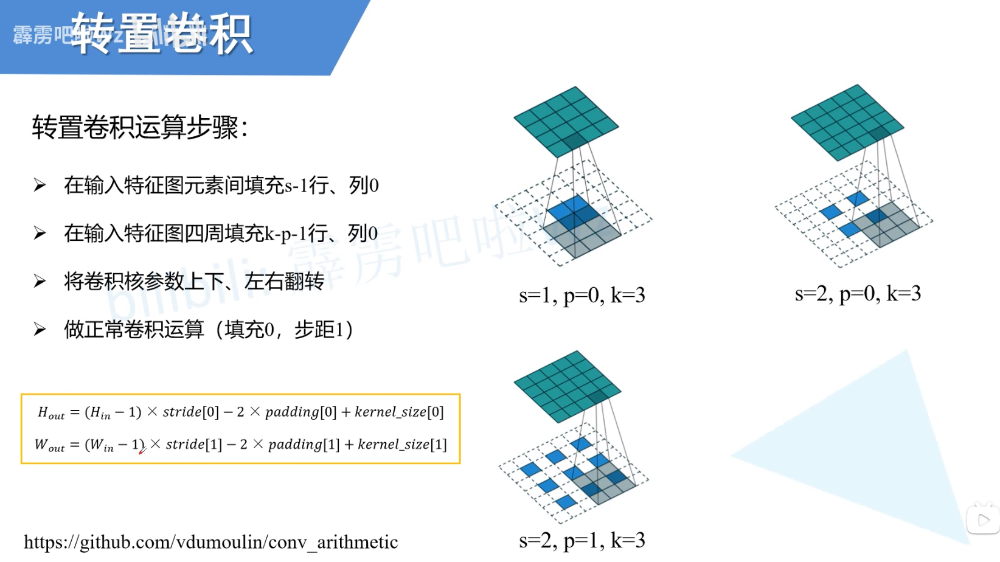

# Code Note

## A1

### pytorch101.py

~~~python
# [i, j] 与 [i][j]访问的区别
for index in range(len(indices)):
      i, j = indices[index]
      x[i, j] = values[index]
    
# torch.full() / torch.ones() / torch.zeros() / torch.ones_like() / torch.zeros_like()
x = torch.full((M, N), 3.14)

# 切片操作
last_row = x[x.shape[0] - 1, :]
third_col = x[:, 2:3]
first_two_rows_three_cols = x[0:2, 0:3]
even_rows_odd_cols = x[0::2, 1::2]

# 维度操作 / torch.view() / torch.reshape()
y = x.view(2, 3, 4)
y = y.transpose(0, 1)
y = y.reshape(3, 8)

# torch.clone() / torch.arange() / argmin()
y = x.clone()
col_min_idxs = y.argmin(dim = 1)
idx0 = torch.arange(y.shape[0])
y[idx0, col_min_idxs] = 0

# torch.sum() / torch.mean()
M, N = x.shape
means = x.mean(dim = 0)
x_centered = x - means
squared_diff = x_centered ** 2
variance = squared_diff.sum(dim = 0) / (M - 1)
std = (variance ** 0.5)
y = x_centered / std

# torch.mm() / @
y = x.mm(w)
x_gpu = x.cuda()
w_gpu = w.cuda()
y = x_gpu @ w_gpu
~~~

### knn.py

~~~python
# torch.sum() + keepdim
x_train_flat = x_train.view(num_train, -1)
x_test_flat = x_test.view(num_test, -1)
train_squared = torch.sum(x_train_flat ** 2, dim=1, keepdim=True)
test_squared = torch.sum(x_test_flat ** 2, dim=1, keepdim=True).t()
cross_term = torch.mm(x_train_flat, x_test_flat.t())
dists = train_squared - 2 * cross_term + test_squared

# torch.topk() / torch.bincount()
for j in range(num_test):
    distances = dists[:, j]
    _, neighbors = torch.topk(distances, k = k, largest = False)
    nearest_labels = y_train[neighbors]
    label_counts = torch.bincount(nearest_labels)
    y_pred[j] = torch.argmax(label_counts)
    
# torch.cat()
k_to_accuracies = {k: [] for k in k_choices}
for fold in range(num_folds):
    x_val_fold = x_train_folds[fold]
    y_val_fold = y_train_folds[fold]

    x_train_fold = torch.cat(
        [x_train_folds[i] for i in range(num_folds) if i != fold], dim=0
    )
    y_train_fold = torch.cat(
        [y_train_folds[i] for i in range(num_folds) if i != fold], dim=0
    )

    for k in k_choices:
        knn_classifier = KnnClassifier(x_train_fold, y_train_fold)
        y_pred = knn_classifier.predict(x_val_fold, k)
        accuracy = (y_pred == y_val_fold).float().mean().item()
        k_to_accuracies[k].append(accuracy)
~~~

## A2

### linear_classifier.py

~~~python
# 计算细节
def svm_loss_vectorized(
    W: torch.Tensor, X: torch.Tensor, y: torch.Tensor, reg: float
):
    return loss, dW

def softmax_loss_vectorized(
    W: torch.Tensor, X: torch.Tensor, y: torch.Tensor, reg: float
):
    return loss, dW
~~~

## A3

### fully_connected_networks.py

~~~python
class Dropout(object):

    @staticmethod
    def forward(x, dropout_param):
        """
        Performs the forward pass for (inverted) dropout.
        Inputs:
        - x: Input data: tensor of any shape
        - dropout_param: A dictionary with the following keys:
          - p: Dropout parameter. We *drop* each neuron output with
            probability p.
          - mode: 'test' or 'train'. If the mode is train, then
            perform dropout;
          if the mode is test, then just return the input.
          - seed: Seed for the random number generator. Passing seed
            makes this
            function deterministic, which is needed for gradient checking
            but not in real networks.
        Outputs:
        - out: Tensor of the same shape as x.
        - cache: tuple (dropout_param, mask). In training mode, mask
          is the dropout mask that was used to multiply the input; in
          test mode, mask is None.
        NOTE: Please implement **inverted** dropout, not the vanilla
              version of dropout.
        See http://cs231n.github.io/neural-networks-2/#reg for more details.
        NOTE 2: Keep in mind that p is the probability of **dropping**
                a neuron output; this might be contrary to some sources,
                where it is referred to as the probability of keeping a
                neuron output.
        """
        p, mode = dropout_param['p'], dropout_param['mode']
        if 'seed' in dropout_param:
            torch.manual_seed(dropout_param['seed'])

        mask = None
        out = None

        if mode == 'train':
            ##############################################################
            # TODO: Implement training phase forward pass for            #
            # inverted dropout.                                          #
            # Store the dropout mask in the mask variable.               #
            ##############################################################
            # Replace "pass" statement with your code
            mask = (torch.rand(x.shape, device=x.device) < (1 - p)) / (1 - p)  # first dropout mask. Notice /p!
            out = x * mask # drop!
            ##############################################################
            #                   END OF YOUR CODE                         #
            ##############################################################
        elif mode == 'test':
            ##############################################################
            # TODO: Implement the test phase forward pass for            #
            # inverted dropout.                                          #
            ##############################################################
            # Replace "pass" statement with your code
            out = x
            ##############################################################
            #                      END OF YOUR CODE                      #
            ##############################################################

        cache = (dropout_param, mask)

        return out, cache

    @staticmethod
    def backward(dout, cache):
        """
        Perform the backward pass for (inverted) dropout.
        Inputs:
        - dout: Upstream derivatives, of any shape
        - cache: (dropout_param, mask) from Dropout.forward.
        """
        dropout_param, mask = cache
        mode = dropout_param['mode']

        dx = None
        if mode == 'train':
            ###########################################################
            # TODO: Implement training phase backward pass for        #
            # inverted dropout                                        #
            ###########################################################
            # Replace "pass" statement with your code
            dx = dout * mask
            ###########################################################
            #                     END OF YOUR CODE                    #
            ###########################################################
        elif mode == 'test':
            dx = dout
        return dx
~~~

### convolutional_networks.py

~~~python
# torch.nn.functional.pad()
x, w, b, conv_param = cache
stride = conv_param['stride']
pad = conv_param['pad']
N, C, H, W = x.shape
F, _, HH, WW = w.shape
_, _, H_out, W_out = dout.shape

x_padded = torch.nn.functional.pad(x, (pad, pad, pad, pad), mode='constant', value=0)
dx_padded = torch.zeros_like(x_padded)
dw = torch.zeros_like(w)
db = torch.zeros_like(b)

for n in range(N):
    for f in range(F):
        db[f] = torch.sum(dout[:, f])
        for h in range(H_out):
            for w_idx in range(W_out):
                grad = dout[n, f, h, w_idx]
                h_start = h * stride
                w_start = w_idx * stride

                dx_padded[n, :, h_start:h_start+HH, w_start:w_start+WW] += grad * w[f]
                dw[f] += grad * x_padded[n, :, h_start:h_start+HH, w_start:w_start+WW]
dx = dx_padded[:, :, pad:pad+H, pad:pad+W]

# Conv / MaxPool / BatchNorm / Kaiming_initializer
~~~

## A4

### common.py

backbone+fpn提取三个大小的特征

~~~python
# F.interpolate() 上滤用法
c3 = backbone_feats["c3"]
p3_lateral = self.fpn_params["lateral_c3"](c3)
p4_upsampled = F.interpolate(p4, size=c3.shape[-2:], mode='nearest')
p3 = p3_lateral + p4_upsampled
fpn_feats["p3"] = self.fpn_params["output_p3"](p3)
~~~

~~~python
# torch.meshgrid() / torch.stack() 建立坐标系
_, _, H, W = feat_shape
x_coords = (torch.arange(W, dtype=dtype, device=device) + 0.5) * level_stride
y_coords = (torch.arange(H, dtype=dtype, device=device) + 0.5) * level_stride       
        
y_grid, x_grid = torch.meshgrid(y_coords, x_coords, indexing='ij')
        
x_grid_flat = x_grid.reshape(-1)
y_grid_flat = y_grid.reshape(-1)
        
coords = torch.stack([x_grid_flat, y_grid_flat], dim=1)
~~~

### one_stage_detector.py

fpn提取特征 -> prediction head计算出每个location的deltas和class

~~~python
# loss_cls的计算 F.one_hot()用法 
target_cls = F.one_hot((matched_gt_boxes[:, :, -1] + 1).long(), num_classes = self.num_classes + 1)
loss_cls = sigmoid_focal_loss(pred_cls_logits, target_cls[:, :, 1:].float())

loss_box = 0.25 * F.l1_loss(
    pred_boxreg_deltas, matched_gt_deltas, reduction="none"
)
loss_box[matched_gt_deltas < 0] *= 0.0

# shape匹配问题
matched_gt_centerness = fcos_make_centerness_targets(matched_gt_deltas.view(-1, 4)) 
loss_ctr = F.binary_cross_entropy_with_logits(
    pred_ctr_logits.view(-1), matched_gt_centerness, reduction="none"
)
loss_ctr[matched_gt_centerness < 0] *= 0.0
~~~

### two_stage_detector.py

fpn提取特征 -> rpn计算proposals -> proposals reassign回对应stride层 -> proposals提取对应层特征 -> roi_align整合为同一大小 -> prediction head 计算 每个box的 class (理论上还需微调deltas)

~~~python
# 扩展维度+广播 unsqueeze()
boxes1_expanded = boxes1.unsqueeze(1)  # [M,1,4]
    
xy1_intersection = torch.maximum(
    boxes1_expanded[:, :, :2],  # [M,1,2]
    boxes2[:, :2]         # [N,2] -> [1,N,2]
)  # [M,N,2]

xy2_intersection = torch.minimum(
    boxes1_expanded[:, :, 2:],  # [M,1,2]
    boxes2[:, 2:]         # [N,2] -> [1,N,2]
)  # [M,N,2]

wh_intersection = xy2_intersection - xy1_intersection  
wh_intersection = torch.clamp(wh_intersection, min=0)  
area_intersection = wh_intersection[:, :, 0] * wh_intersection[:, :, 1]

wh1 = boxes1[:, 2:] - boxes1[:, :2]  # [M,2]
area1 = wh1[:, 0] * wh1[:, 1]     # [M]
wh2 = boxes2[:, 2:] - boxes2[:, :2]  # [N,2]
area2 = wh2[:, 0] * wh2[:, 1]     # [N]

area1_expanded = area1.unsqueeze(1)   # [M,1]
area2_expanded = area2.unsqueeze(0)   # [1,N]
area_union = area1_expanded + area2_expanded - area_intersection  # [M,N]

iou = area_intersection / area_union
~~~

~~~python
## torchvision.ops.roi_align()
roi_feats = torchvision.ops.roi_align(
    level_feats, level_props, output_size=self.roi_size, 
    spatial_scale=1.0 / level_stride, aligned=True
)
~~~

~~~python
#.long() / .float()
num_samples = self.batch_size_per_image * num_images
fg_idx, bg_idx = sample_rpn_training(matched_gt_boxes, num_samples, 
                    fg_fraction=0.25)
sampled_indices = torch.cat([fg_idx, bg_idx])

pred_cls_logits = pred_cls_logits[sampled_indices]
matched_gt_boxes = matched_gt_boxes[sampled_indices]

num_classes = self.num_classes + 1
target_cls = F.one_hot((matched_gt_boxes[:, -1] + 1).long(), num_classes=num_classes)
loss_cls = F.cross_entropy(pred_cls_logits, target_cls.float())
~~~

~~~python
# FasterR-CNN的输入通道
curr_channels = backbone.out_channels
        
for out_channels in stem_channels:
    conv_cls = nn.Conv2d(
        curr_channels, 
        out_channels,
        kernel_size=3,
        padding=1,  
        stride=1,
        bias=True,
    )
    torch.nn.init.normal_(conv_cls.weight, mean=0, std=0.01)
    torch.nn.init.constant_(conv_cls.bias, 0)

    cls_pred.extend([conv_cls, nn.ReLU()])

    curr_channels = out_channels
~~~

~~~python
# num_samples
num_samples = self.batch_size_per_image * num_images
fg_idx, bg_idx = sample_rpn_training(matched_gt_boxes, num_samples, 0.5)
sampled_indices = torch.cat([fg_idx, bg_idx])

sampled_pred_obj = pred_obj_logits[sampled_indices]
sampled_pred_boxreg_deltas = pred_boxreg_deltas[sampled_indices]
sampled_gt = matched_gt_boxes[sampled_indices]
sampled_anchors = anchor_boxes[sampled_indices]

sampled_gt_deltas = rcnn_get_deltas_from_anchors(sampled_anchors, sampled_gt[:, :4])

loss_obj = F.binary_cross_entropy_with_logits(
    sampled_pred_obj,
    (sampled_gt[:, 4] > 0).float(),
    reduction="none"
)

loss_box = F.l1_loss(
    sampled_pred_boxreg_deltas,
    sampled_gt_deltas,
    reduction="none"
)
loss_box[sampled_gt_deltas == -1e8] *= 0.0
~~~

~~~python
@torch.no_grad()
def reassign_proposals_to_fpn_levels(
    proposals_per_image: List[torch.Tensor],
    gt_boxes: Optional[torch.Tensor] = None,
    fpn_level_ids: List[int] = [3, 4, 5],
) -> Dict[str, List[torch.Tensor]]:
    
    return proposals_per_fpn_level
~~~

Ah,我现在来详细解释一下`reassign_proposals_to_fpn_levels`函数在Faster R-CNN中的具体作用：

1. **为什么需要这个函数？**
- RPN阶段生成的proposals虽然来自不同FPN层级，但在传递到下一阶段时，我们丢失了这些proposals原本属于哪个FPN层级的信息
- 即使知道原始层级，一个proposal可能已经通过RPN的边界框回归发生了很大变化（比如一个来自P5的大框被回归成了一个小框）
- 为了在RoIAlign阶段选择最合适的特征层级，我们需要重新根据proposal的大小分配FPN层级

2. **在pipeline中的位置**：
```
图像 → Backbone+FPN → RPN生成proposals 
→ reassign_proposals_to_fpn_levels函数重新分配层级 
→ RoIAlign从对应层级提取特征 → 检测头
```

3. **具体作用**：
- 根据每个proposal的面积大小，使用公式计算其应该属于哪个FPN层级：
  ```python
  k = 4 + log2(sqrt(area)/224)  # 论文公式(1)
  ```
- 大框会被分配到更高的FPN层级（如P5）
- 小框会被分配到更低的FPN层级（如P3）
- 这确保了在RoIAlign时从最合适的特征分辨率提取特征

4. **训练时的额外功能**：
- 在训练阶段，会将GT boxes也混合到proposals中
- GT boxes同样按照大小分配到不同FPN层级
- 这样做可以提供更好的训练样本，特别是在RPN训练初期其生成的proposals质量不高时

这个函数是连接RPN和检测头的关键组件，它确保了每个proposal都能从最合适的特征层级提取特征，从而提高检测的准确性。这也是FPN论文中的一个重要创新点。

## A5

### rnn_lstm_captioning.py

~~~python
# 前向传播的计算
def rnn_step_forward(x, prev_h, Wx, Wh, b):
    return next_h, cache

# 反向传播梯度的计算
def rnn_step_backward(dnext_h, cache):
    return dx, dprev_h, dWx, dWh, db
~~~

$$
h_t = tanh(pre_h) \qquad \frac{\partial{h_t}}{\partial{pre_h}} = 1-tanh^2(pre_h)
$$

~~~python
# x.shape = (N, T) W.shape = (V, D) out.shape = (N, T, D)
# 高级索引机制
def word_embedding_forward(x, W):
   
    out = W[x]
    cache = (x, W)

    return out, cache

# 反向传播原理 / np.add.at() 与 += 区别 / np.add.at()并行性差
def word_embedding_backward(dout, cache):
    return dW
~~~

~~~python
# mask的含义 / x(scores) 从 h 转变来
def temporal_softmax_loss(x, y, mask, verbose=False):
    return loss, dx
~~~

~~~python
# attn_lstm的feature_proj为Conv2D
def dot_product_attention(prev_h, A):
    """
    A simple scaled dot-product attention layer.

    Args:
        prev_h: The LSTM hidden state from previous time step, of shape (N, H)
        A: **Projected** CNN feature activation, of shape (N, H, 4, 4),
         where H is the LSTM hidden state size

    Returns:
        attn: Attention embedding output, of shape (N, H)
        attn_weights: Attention weights, of shape (N, 4, 4)

    """
    N, H, D_a, _ = A.shape

    attn, attn_weights = None, None
    ##########################################################################
    # TODO: Implement the scaled dot-product attention we described earlier. #
    # You will use this function for `AttentionLSTM` forward and sample      #
    # functions. HINT: Make sure you reshape attn_weights back to (N, 4, 4)! #
    ##########################################################################
    # Replace "pass" statement with your code

    attn_scores = (prev_h.reshape(N, H, 1, 1) * A).sum(dim=1) / (H ** 0.5)
    attn_weights = F.softmax(attn_scores.reshape(N, -1), dim=-1).reshape(N, D_a, D_a)
    attn = (attn_weights.view(N, 1, D_a, D_a) * A).sum(dim = (2, 3))

    ##########################################################################
    #                             END OF YOUR CODE                           #
    ##########################################################################

    return attn, attn_weights
~~~

### Tranformer.py

~~~python
# for loop 创造 list写法 / nn.ModuleList用法
self.attention_heads = nn.ModuleList([
    SelfAttention(dim_in, dim_out, dim_out) for _ in range(num_heads)
])

# 广播机制的深入理解，最后一维需要对齐 / unbiased用法
def forward(self, x: Tensor):
    mean = x.mean(dim=-1, keepdim=True)
    var = x.var(dim=-1, unbiased=False, keepdim=True)
    x_normalized = (x - mean) / torch.sqrt(var + self.epsilon)
    y = self.gamma * x_normalized + self.beta

    return y
~~~

## A6

### vae.py

~~~python
# reparametrize与直接采样相比的优点
~~~

### gan.py

~~~python
# D_loss / G_loss怎么算
# nn.ConvTranspose2d用法 具体过程
~~~


